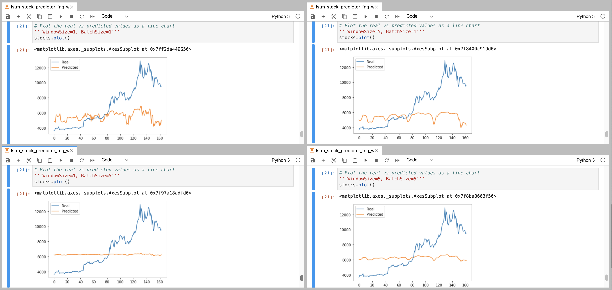
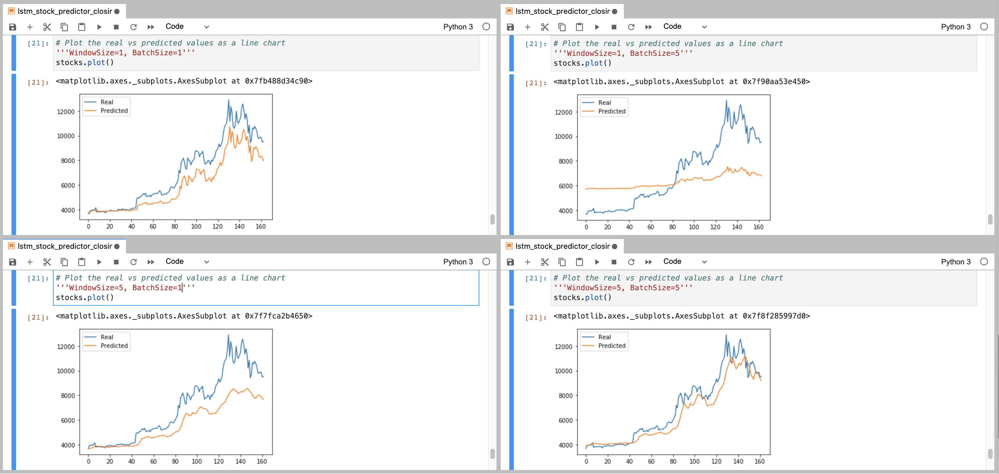

# LSTM Stock Predictor

Due to the volatility of cryptocurrency speculation, investors will often try to incorporate sentiment from social media and news articles to help guide their trading strategies. One such indicator is the [Crypto Fear and Greed Index (FNG)](https://alternative.me/crypto/fear-and-greed-index/) which attempts to use a variety of data sources to produce a daily FNG value for cryptocurrency. We have been asked to help build and evaluate deep learning models using both the FNG values and simple closing prices to determine if the FNG indicator provides a better signal for cryptocurrencies than the normal closing price data.

### Given Data and Parameters

One model will use the FNG indicators to predict the closing price while the second model uses a window of closing prices to predict the nth closing price.

For the Fear and Greed model, we used the FNG values to try and predict the closing price. For the closing price model, we used previous closing prices to try and predict the next closing price.

Each model used 70% of the data for training and 30% of the data for testing. We used a MinMaxScaler to the X and y values to scale the data for the model and reshaped the X_train and X_test values to fit the model's requirement of (samples, time steps, features).

### Build and train custom LSTM RNNs

Each Jupyter Notebook created the same custom LSTM RNN architecture. In one set of notebooks, we fit the data using the FNG values. In the second set of notebooks, we fit the data using only closing prices.

We used the same parameters and training steps for each model. This is necessary to compare each model accurately.

### Evaluate the performance of each model

Finally, we used the testing data to evaluate each model and compare the performance. We played with the window size and the batch size to see if those helped with predictive accuracy.

The models using the Crypto Fear and Greed Index (FNG) did not fare well. There did not seem to be a very tight correlation between FNG and stock price predictions. FNG is not a very good signal for stock prices.

The models using the closing price were much more accurate in their predictive power. Having equal window size and batch size, improved accuracy. Having a small window size and a larger batch size gave the worst outcome (WindowSize=1, BatchSize=5). However, keeping the window size and the batch size to the smallest variable (WindowSize=1, BatchSize=1) gave the most accurate result.

